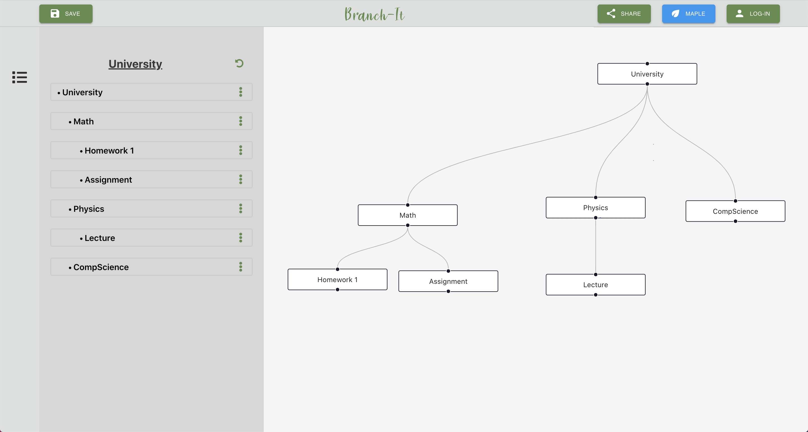

# Branch-It

Welcome to Branch-It, the todo list application that renders your tasks into a dynamic and user-designed node-graph. Moving away from regular nested dot-point lists, Branch-It transforms your list into a readable image, making observing the progress, scope and size of your tasks much easier.



## Built With

- ReactJs
- React Sass
- React Flow Renderer

## Installation

After cloning the project

```
cd FrontEnd

npm install

npm start

```

## File Structure

    .
    ├── FrontEnd
    │       ├── src                          # Source files
    │       │    ├─── API                    # Front-end <-> back-end communication
    │       │    ├─── assets                 # Images and icons
    │       │    ├─── Components             # App components
    │       │    │       ├─── home-page      # List and graph content components
    │       │    │       ├─── list-handling  # List class definition
    │       │    ├─── config                 # Default graph configuration
    │       |    ├─── redux                  # Redux reducer, action and store logic
    │       |    └─── App.js                 # Root component
    │       ├─── public                      # Public assets and html
    │       └─── package.json                # Front-end <-> back-end communication
    └── README.md                            # Project use basics
